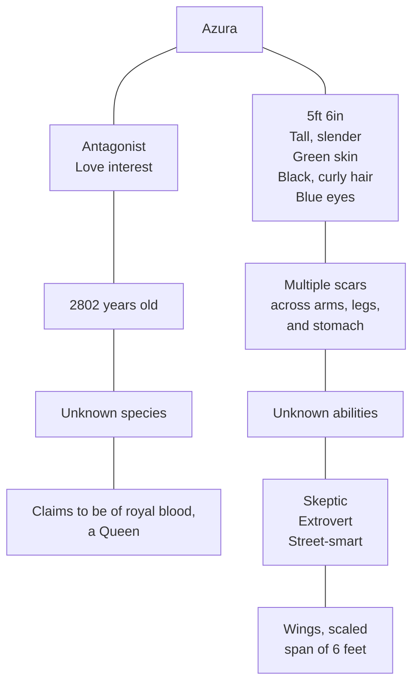
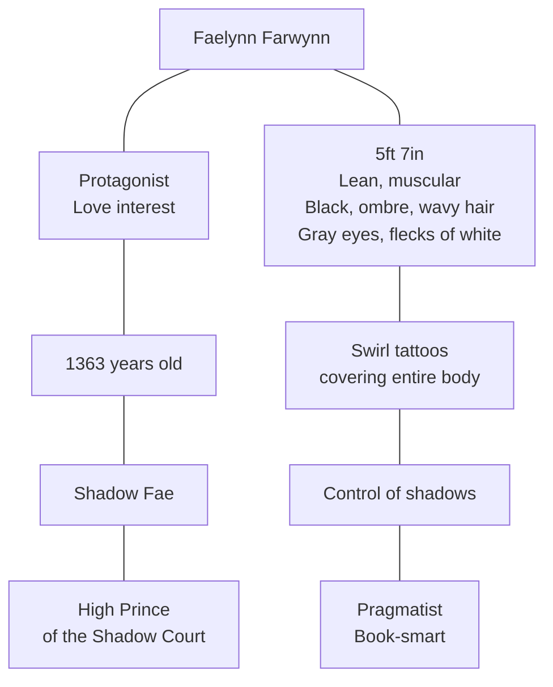
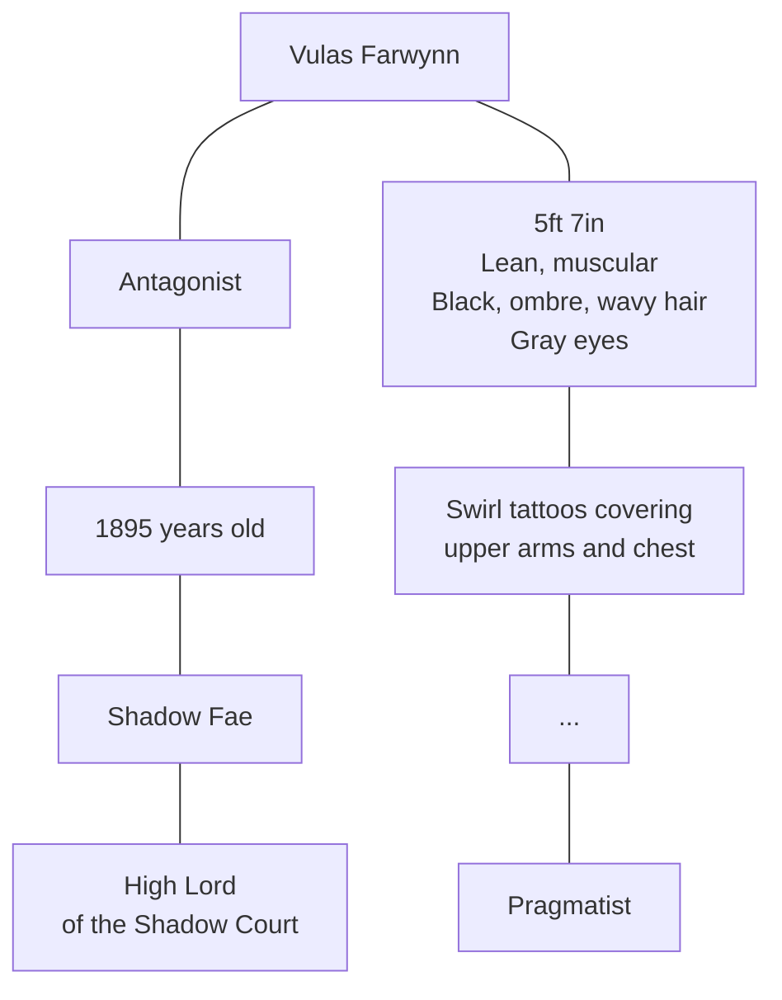

# Characters

## Major Characters

### Azura

<!---->

<!--
At age 439, Azura watched [Vulas Farwynn](#Vulas-Farwynn) murder her family and her entire race. Since that night, she has vowed revenge on the High Lord of the Shadow Court. She plans to make him watch his Court fall apart, just as he had done to her father.

At age 792, Azura was captured by [Válgr](#Valgr), a jotunn who sought to use her for his own agenda. She was then bound and controlled by a ring magically linked to a set of two bracelets and two anklets an old friend had given her. Despite this, she still found ways to defy Válgr. The two may have a common enemy, but Azura has made it clear that she is only interested in punishing the guilty ones, not an entire race.

Her first encounter with Vulas Farwynn's son, [Faelynn](#Faelynn-Farwynn), has her questioning her plans. Faelyn is... unique. She isn't sure what it is about the young prince that fascinates her, but he is different from his father. She keeps telling herself that she is only interested in Faelyn because of his father; yet her mind, and her body, hint at the real truth she doesn't wish to accept. But, denying the thin bond that ties her to him is no easy task, nor can its existence be ignored for much longer.
-->

### Faelynn Farwynn

<!--
All his life, Faelynn Farwynn has sought one thing, his father's approval. Living under the shadow of his father has been difficult. As the Lord of the Shadow Court, and the High Lord's Firstborn he has a great reputation to uphold. Everyone expects him to be ruthless, like his father, which is saying much since most fae are considered ruthless. The things his father has done have truly given the word "ruthless" a new meaning. Faelynn has never had a problem with cruelty, but the time for the brand of ruthlessness the Shadow Court is known for his past. The real enemies have passed, no one dare threatens the Shadow Court except the petty beings that, like ants, spring up every century. Except for now...

Faelynn thought he knew everything about being ruthless, but when he hears what his father has done... that is past ruthless, even dishonorable. But is it true? Or is the blue-eyed, white-haired woman that he can't get out of his thoughts lying?
-->

## Supporting Characters

### Vulas Farwynn

<!--

At 532, destroyed the _____.

### Válgr

## Minor Characters

### Folluin Zingolor

### Rothilion Ennan

### Vulen Fendan
-->
